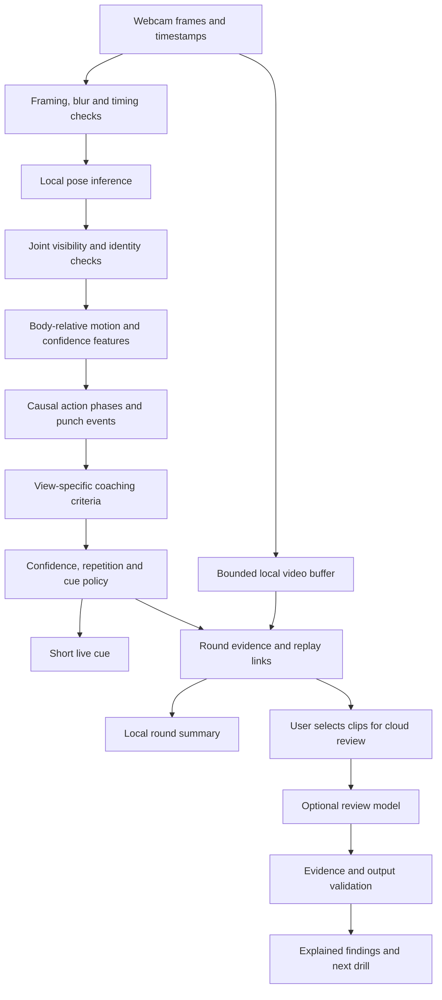

# Shadowboxing AI: product and technical plan

Research checked September 26, 2026. This document is a proposed engineering plan, not a report of achieved accuracy. Linked research notes separate published findings from recommendations.

## Decision

Build a **local, evidence-based drill coach** that can grow into free-form shadowboxing analysis. Use a fast pose model and a temporal action model to establish what happened, evaluate a small set of coach-reviewed criteria, and attach each correction to a replay. Use a language model to explain approved findings and plan subsequent practice.

The core risk is measurement validity: a fluent explanation is useful only when the observed motion supports it. A model that recognizes a cross has not thereby established that the cross was good, bad, powerful, or safe. Our evaluation must keep these claims separate.

Confirmed scope:

- Personal use first for a beginner who knows the basics, with a product designed to serve broader skill levels and body types.
- This M3 MacBook Pro and its built-in webcam. Read-only hardware inspection reports M3 Max and 36 GiB unified memory.
- Local live analysis. Optional cloud review only for selected clips.
- Techniques, combinations, and actionable critique are the product objectives.
- An empty starting repository: no app, collected dataset, or existing model to preserve.

Working assumptions: one person in frame, no opponent or bag, conventional boxing drills, explicit stance selection, and enough room to see the relevant body parts. Access to a human coach for rubric review remains unconfirmed. Memory capacity alone does not establish sustained inference performance.

“Works for anybody” is the expansion objective, not a support claim we can make on day one. Design stance, body-scale calibration, skill level, guard style, and drill intent into the data model now. Expand the tested population deliberately, including novices and experienced boxers, rather than making the user's personal movement pattern the universal reference. A beginner curriculum can have stricter drill constraints while advanced free practice recognizes acceptable style variations.

## What the first product should do

1. Guide camera placement and confirm that the requested drill is visible.
2. Ask for stance and an easy calibration sequence; keep anatomical left/right separate from mirrored screen coordinates.
3. Demonstrate a short, defined drill: initially jab, cross, and jab-cross.
4. Count confidently recognized events, display uncertainty, and measure simple timing.
5. Give occasional short cues after a repetition or between combinations.
6. End the round with one or two priorities and clickable supporting replays.
7. Use a repeat drill to show whether that particular, observable behavior changed.

An illustrative result would be: “Your rear hand moved below your chosen guard zone during 4 of 10 assessable jabs. Review reps 3 and 7. On the next set, keep the rear hand in that guard position while you jab.” The counts must come from actual events, the guard zone must be defined for that drill, and excluded repetitions must be shown. This is an example of intended behavior, not an observation about the user.

Avoid an overall “boxing score” until its meaning and reliability can be established. A count of supported observations is more interpretable than a weighted mix of unrelated estimates.

## Capability boundaries

These are engineering hypotheses to validate, not established webcam accuracy claims.

| Capability | First useful scope | Main condition or limitation |
|---|---|---|
| Jab/cross recognition | Guided repetitions, then short combinations | Need visible wrist/elbow motion and reliable lead/rear mapping |
| Six basic punches | Lead/rear straight, hook, uppercut | Hooks and uppercuts can look similar in projection; require temporal context and an unknown class |
| Combination recognition | Event sequence and timing | Recognize observed events independently; the prompted combination is not the answer label |
| Guard recovery | Return to a coach-approved, personalized visible region | Supports a positional criterion, not proof of defensive effectiveness |
| Non-punching hand position | Defined guard drill | Intentional low guards, parries, and style variations are not automatically errors |
| Visible foot placement / crossing | Selected full-body drills and views | Occlusion and perspective can invalidate a verdict; projected geometry does not establish balance |
| Head movement | Visible relative displacement | “Moved head” does not prove a successful slip against an opponent |
| Elbow path and gross overreach | Selected side/oblique views | A 2D angle is view dependent; depth estimates require validation |
| Hip/shoulder sequencing | Experimental replay analysis | Pelvis orientation and axial rotations are hard to recover from one view |
| Wrist alignment / fist orientation | Research only initially | Closed fists and motion blur limit hand landmarks |
| Power, force, pressure distribution | Excluded from webcam-only claims | These quantities are not directly measured by an ordinary RGB camera |
| Injury diagnosis / joint loading | Excluded | Outside a technique practice product and unsupported by this measurement setup |

MediaPipe supplies estimated 3D coordinates, but its coordinate API is not evidence of metric boxing biomechanics. Modern monocular reconstruction systems can add useful hypotheses; extra inferred detail is not an independent measurement. See [pose research](research/pose-models.md) and [coaching validity](research/coaching-validity.md).

## Current technology choices

Choose the smallest pipeline that passes our own benchmark. Public general-purpose pose scores cannot rank boxing coaching accuracy on this webcam.

| Layer | Initial candidate | Challenger or later upgrade | Decision rule |
|---|---|---|---|
| Live pose | MediaPipe Pose Landmarker Full, with Lite/Heavy comparisons | RTMPose body / RTMW whole-body through a local ONNX runtime | Wrist/elbow visibility, left/right consistency, downstream error, and sustained latency |
| Action detection | Transparent phase/event baseline | Small causal temporal convolutional network over pose and confidence features | Held-out continuous-video event F1 and false activations |
| Action recognition | Pose trajectories + body-relative features | Pose plus cropped RGB motion features | Upgrade only for demonstrated confusion cases |
| Video representations | Optional frozen encoder experiment | V-JEPA 2.1 or another licensed video encoder | Incremental benefit versus compute and training data needs |
| 3D replay analysis | Research adapter | SAM 3D Body / OpenCap Monocular experiments | Boxing-specific reference validation, supported runtime, and artifact terms |
| Review explanation | Templates first | Gemini 3.8 Flash video review; GPT-6 Sol evidence/frame review; open Qwen experiments | Coach-rated unsupported-claim rate and utility, plus cost/latency |
| Speech | Local short cues | Optional conversation after a round | No dependence on cloud speech for the live measurement loop |

SAM 3D Body, V-JEPA 2.1, and OpenCap Monocular are important newer candidates; none establishes that this application works out of the box. Sapiens2 is a research watchlist item with restrictive terms requiring review before adoption. The model research documents give exact sources, release context, and licensing caveats.

MediaPipe is the first integration baseline because it has an established web path, not because it has already won an accuracy comparison. Its synchronous inference should run in a worker to keep the interface responsive. [Official web guide](https://developers.google.com/edge/mediapipe/solutions/vision/pose_landmarker/web_js).

## System architecture



Two operating modes share the same event schema:

- **Live:** bounded memory, causal features, modest latency, conservative cues. The most recent useful frame wins when overloaded. Dropped frames are recorded and can invalidate a rapid event.
- **Replay:** full saved temporal context, optional heavier models, frame stepping, and more detailed uncertainty. Replay can revise an event, but must label revisions and cannot be used to inflate claims about live accuracy.

Keep cloud review outside the live dependency chain. The app remains usable without network access after its assets are available. A timeout or model refusal must leave the local evidence intact.

### Suggested implementation stack

Use React + TypeScript + Vite for the local camera, drill, and replay interface. Run MediaPipe in a Web Worker. Keep the feature extraction, event definitions, and rule configuration in separate modules. Use a Python research package for dataset tools, training, offline evaluation, and alternative pose inference. Use PyTorch for training and evaluate ONNX exports for inference.

For the RTM comparison, first run the same saved clips offline. If it wins materially, evaluate a local Python service bound to loopback, with ONNX Runtime/Core ML where supported. Benchmark the complete detector, crop, pose, transport, and postprocessing path. An execution provider existing does not prove that every operator stays accelerated. A browser ONNX/WebGPU export is a separate portability experiment. [Core ML execution provider](https://onnxruntime.ai/docs/execution-providers/CoreML-ExecutionProvider.html).

Use IndexedDB for initial browser session metadata and explicit video exports; use local files for the research corpus. Add a native shell only if browser capture, storage, or inference constraints justify it. Accounts, distributed queues, and a hosted database are unnecessary for the personal MVP.

Keep provider credentials in a local service or a later server-side relay, never in the browser bundle. A local service should bind to loopback and validate caller origins. Loading bundled models should not silently upload session data; selected-clip review needs an explicit selection/export action in the product.

Proposed structure, to be created when implementation begins:

```text
apps/web/                 camera, calibration, drills, replay
packages/contracts/      versioned pose/event/finding schemas
packages/motion/         normalization, features, causal events
packages/coaching/       criterion definitions and cue policy
services/local-inference/ optional alternative pose backend
ml/                      preprocessing, training, evaluation
configs/                 model manifests and drill definitions
docs/                    decisions, protocols, research
data/                    ignored private corpus
models/                  ignored downloaded weights
```

### Capture and coordinates

Request a reasonable camera resolution/frame rate, then report what was actually delivered. Measure decoded frame intervals, duplicates, gaps, and processing delay; do not assume the webcam supplies 60 fps. At 30 fps, adjacent samples are about 33 ms apart; interpolation cannot recover motion never captured.

Use real frame/media timestamps, not just `frame_index / requested_fps`. Browser video callbacks expose timing metadata and presented-frame counts, but exact sensor capture time is not available in every path. Label latency measurements accordingly. [Video frame callback API](https://developer.mozilla.org/en-US/docs/Web/API/HTMLVideoElement/requestVideoFrameCallback).

Keep raw frames unmirrored for inference and annotation. Mirror only the preview, mapping overlays consistently. Ask the user to confirm a raised left hand. Track anatomical side, lead/rear role, stance, and view orientation separately. A stance switch or lost track triggers recalibration for affected criteria.

Compute image geometry in pixels or aspect-correct coordinates: normalized x and y use different image dimensions. Normalize feature lengths using stable body proportions, but retain separate translation and rotation channels so normalization does not erase footwork or torso motion. Preserve raw landmarks, missing-data masks, and filtered landmarks. A smoother can conceal wrist peaks and delay events; compare it against raw trajectories.

Do not convert inferred depth directly into meters per second. Start with durations and normalized image/body-relative displacement within matched views.

### Temporal recognition

Represent each punch as preparation, extension/arc, peak, and recovery, allowing ambiguous or missing boundaries. Shadowboxing has no impact event to measure. Use an independently estimated event stream for combination matching, including repeated punches, pauses, missed actions, and extra actions.

Initial features include wrist displacement relative to shoulder/torso, velocities using actual timestamp deltas, elbow configuration, shoulder/hip relations, stance, visibility, and frame-gap indicators. Start with inspectable event rules and a simple classifier baseline; train a small causal TCN when data supports it. Evaluate pose-only against pose-plus-RGB features rather than assuming either is sufficient.

Include rest, walking, guard adjustment, feint, defensive movement, and unknown motion. A six-way classifier that must call every movement a punch is unusable. An uncertain hand during occlusion should not silently become the opposite hand.

### Coaching logic

Every criterion needs a technique/drill context, acceptable viewpoints, required visible joints, phase applicability, definition, tolerance, minimum duration, and explicit abstention cases. Thresholds are hypotheses until compared with coach annotations. Personalized calibration adapts scale and a reviewed reference position; it must not treat the user's habitual mistake as the correct target.

Use separate estimates for observation quality, action identity, and the critique. A high-confidence pose result is not a calibrated probability that a coaching claim is correct. Calibrate downstream outputs with held-out labels and measure reliability at the threshold used for feedback.

A finding includes: session/event IDs; criterion and version; start/end timestamps; supporting measurements and units; view and visibility; action label; confidence provenance; evidence frame/clip references; status (`supported`, `uncertain`, `not_assessable`); approved cue; and model versions. Keep the observation separate from the interpretation and the recommended next action.

Cue selection should favor a repeated, well-supported, useful issue. Rate-limit speech, avoid talking over a fast combination, suppress duplicate cues, and cancel stale queued cues. Give one focus at a time. “I lost sight of your rear hand” is an acquisition message, not a technique correction.

### Optional review model

Supply a small evidence packet: selected original clips or ordered timestamped frames, raw and annotated views, structured events, the exact criterion definitions, and explicit unknowns. Never send only a skeleton and ask for a comprehensive diagnosis.

Require structured findings referring to actual evidence IDs. Reject invalid timestamps, nonexistent events, invented measurements, unsupported claims about hidden joints, and contradictions of the provided visibility state. A model may propose an additional hypothesis for review; it must not promote that hypothesis into a live correction without validation. LLM-generated numeric confidence is not calibrated confidence.

Gemini's default video sampling is 1 fps; that setting can miss an entire rapid punch. Its current API supports configurable sampling and agentic video inspection. Test sampling explicitly on short events, with known clip offsets, and verify what reaches the model. GPT-6 Sol's documented modalities include images but no native video input, so use ordered frames plus events for that candidate. [Detailed review research](research/video-review.md).

## Data strategy

Start with the user's own consented sessions in this room, while designing and recruiting a small mixed-skill evaluation cohort in parallel. Usefulness for this user is the first milestone; athlete-held-out cohort performance is a separate gate before broader availability. Public punch datasets can help initialize recognition but do not supply a trustworthy technique-error curriculum.

The first capture set should span multiple days, supported camera views, comfortable slow-to-normal movement, different lighting/clothing, and realistic non-punch motion. Avoid artificially balancing away idle time in the continuous test set. A coach should define and label both acceptable and faulty examples, with “not visible” and “ambiguous” available. Do not instruct an untrained user to exaggerate potentially harmful errors to generate data.

Use explicit recording and training permissions. Keep original session IDs and provenance through trimming, augmentation, and pose extraction. Split by original session **before** creating overlapping windows. For personal use, hold out entire later sessions; for expansion, hold out people and environments too. A personalized result says nothing about new-boxer performance.

An initial 200–400 diverse events is a pipeline/feasibility corpus, not sufficient evidence for a universal coach. Grow difficult classes and criterion labels through error analysis, with new test sessions kept untouched. Determine sample sizes from uncertainty and use-case coverage rather than a round-number target. A second coach should independently review a blinded subset covering every enabled criterion, hard negatives, acceptable style variants, and unobservable cases before broad release. Size it to estimate agreement meaningfully, and preserve disagreements instead of hiding them in consensus labels.

See the [dataset investigation and evaluation design](research/data-and-evaluation.md) for BoxingVI, BoxMind, quality-assessment research, and annotation details.

## Release gates

These are **proposed acceptance targets**, not measured results. Freeze each protocol before tuning and report confidence intervals and coverage. A target can be revised with a documented rationale; it cannot be retroactively portrayed as passed.

| Dimension | Initial proposed gate | Measurement |
|---|---|---|
| Sustained live operation | 20-minute session without growing inference backlog; p95 processed-frame age ≤150 ms | On this Mac; report effective pose cadence/drop ratio and event accuracy together, with timestamp origin documented |
| Guided jab/cross events | Precision ≥95%, recall ≥90% on supported views | One-to-one event matching at tIoU ≥0.5; wrong-side labels fail; include idle/unknown segments; report each supported action/stance/view condition |
| Event response | p95 event-finalization delay ≤350 ms after annotated event end | Live causal replay; report the boundary definition and full distribution |
| Individual critique | Precision point estimate ≥95%, with one-sided 95% lower bound ≥90% | Coach-labeled supported findings; analyze session clustering and label uncertainty |
| Assessment coverage | Assess ≥70% of otherwise eligible events for each enabled criterion | Define eligibility from protocol/independent labels before inference, never the model's own confidence; also report unconditional all-event coverage |
| Nuisance corrections | ≤1 false corrective cue per 5 minutes of realistic use | Measure emitted cues after smoothing and cooldown, not just raw rule decisions |
| Bad visibility | ≥95% abstention on curated unassessable examples | Also measure mistaken abstention on valid footage |
| Review explanations | Every factual movement claim traceable to validated evidence; audit unsupported-claim rate | Automated reference checks plus blinded coach review |
| Personal progress signal | Evidence of improvement retained in a later matched-view session | Coach-rated criterion outcomes; promising personal evidence, not causal or population-wide efficacy proof |

Recognition precision alone is insufficient: the system could count only easy punches. Critique precision alone is insufficient: the system could stay silent. Report recognition recall, assessment coverage, false cues, and the size/composition of the evaluated sample together. An abstention is not a correct negative.

For six punches, report class-wise event metrics and the confusion matrix; do not conceal uppercut failures in a pooled score. For combinations, report edit distance, exact sequence match, and per-event timing. Predicted punch phases must not borrow future frames in the live benchmark. Faster-than-realtime offline processing does not by itself prove live responsiveness.

Establish generalized learning benefit through a later prospective comparison with equal practice time, feedback versus control, blinded coach ratings, and retention testing. A single user's pre/post improvement cannot isolate the benefit of the AI from ordinary practice.

## Milestones and effort

Estimates assume one focused engineer, available recording sessions, and timely coach review. They are planning ranges, not delivery promises. Progress is gated by evidence, not by the calendar.

| Phase | Indicative effort | Deliverable and exit condition |
|---|---|---|
| 0. Camera and replay lab | 3–5 working days | Calibration, local recording/export, pose adapters, synchronized replay, timing telemetry, first test protocol |
| 1. Measurement comparison | 1–2 weeks | Same clips through MediaPipe and RTM variants; manual wrist/elbow audit; documented model/view choice |
| 2. Personal guided MVP | 2–3 weeks | Jab/cross/1–2 drills, causal events, 2–3 validated criteria, evidence replays, conservative voice cues |
| 3. Six punches and combinations | 2–4 additional weeks | More labeled data, hooks/uppercuts, unknown motion handling, meaningful free-form evaluation |
| 4. Replay intelligence | After reliable evidence exists | Provider comparison, optional selected-clip review, personalized practice planning |
| 5. Broader beta | Separate data/validation project | Diverse participants, athlete-held-out testing, independent coach review, packaging and data controls |

Expect a useful personal prototype on the order of 4–8 weeks if the camera and labels cooperate; a credible general coaching product requires substantially more data and iteration. A failed observability gate narrows the criterion or asks for another view; it does not justify confident output from a larger model.

## Resource allocation

Use existing hardware first. The highest-value early spending is likely coach annotation/review, followed by better capture conditions if the audit identifies them. This is an engineering priority recommendation, not a vendor quote.

Set an optional experiment budget, for example $50–$150 for selected cloud reviews or short GPU trials, with a hard per-run cap. This is a user-configurable planning envelope; no paid service has been called or authorized for purchase. Estimate each provider run using actual frames/tokens and current prices before execution. Avoid full-session streaming when the purpose can be served by a few selected clips.

Storage arithmetic: a 10-minute video at 4–8 Mbit/s is roughly 300–600 MB; actual codec output varies. Store only intentional recordings or bounded temporary buffers and expose deletion/export controls. Keep model and data manifests in Git while leaving weights and private footage out.

## Risks and decisions to revisit

| Risk | Experiment or response |
|---|---|
| Wrists disappear behind body or fists blur | Compare view/lighting and model variants; abstain on unsupported phases |
| Image-space thresholds reward the wrong movement | Coach annotations, criterion-specific view gates, and counterexamples |
| Personal model memorizes a room/session | Later-day holdouts, background changes, and no overlapping-window leakage |
| Training and browser exports disagree | Golden-clip parity checks on landmarks, events, and final findings |
| Polished cloud critique invents detail | Evidence constraints, claim audits, and a templates-only fallback |
| Cloud model updates change behavior | Pin version where possible and rerun a frozen review set |
| Model/dataset rights prevent reuse | Track code, weight, and dataset terms independently; use owned data by default |
| Too many interruptions reduce usefulness | Cue cooldown, post-combination timing, one focus, and user feedback |
| Camera cannot support a desired criterion | Make it replay-only, request a different view, or defer it |

The next implementation step should be the [camera and benchmark sprint](first-sprint.md). It establishes whether the desired coach has reliable inputs before adding a large feature surface.
